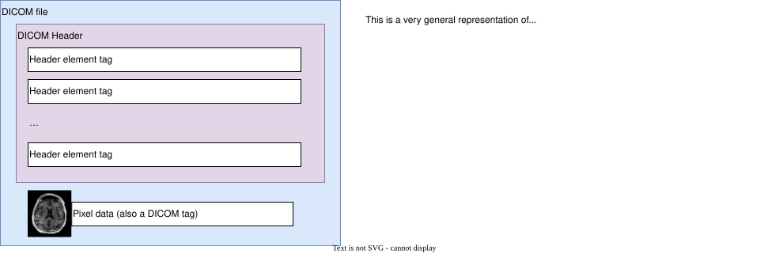
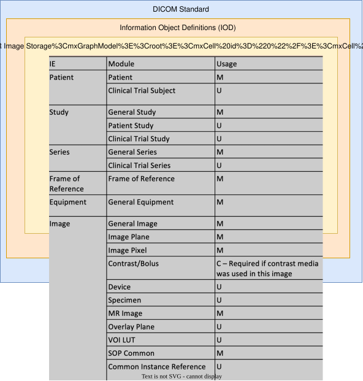
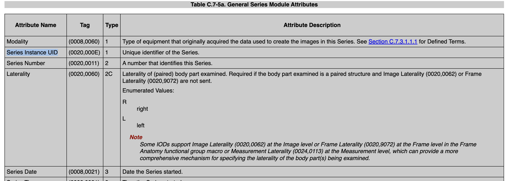
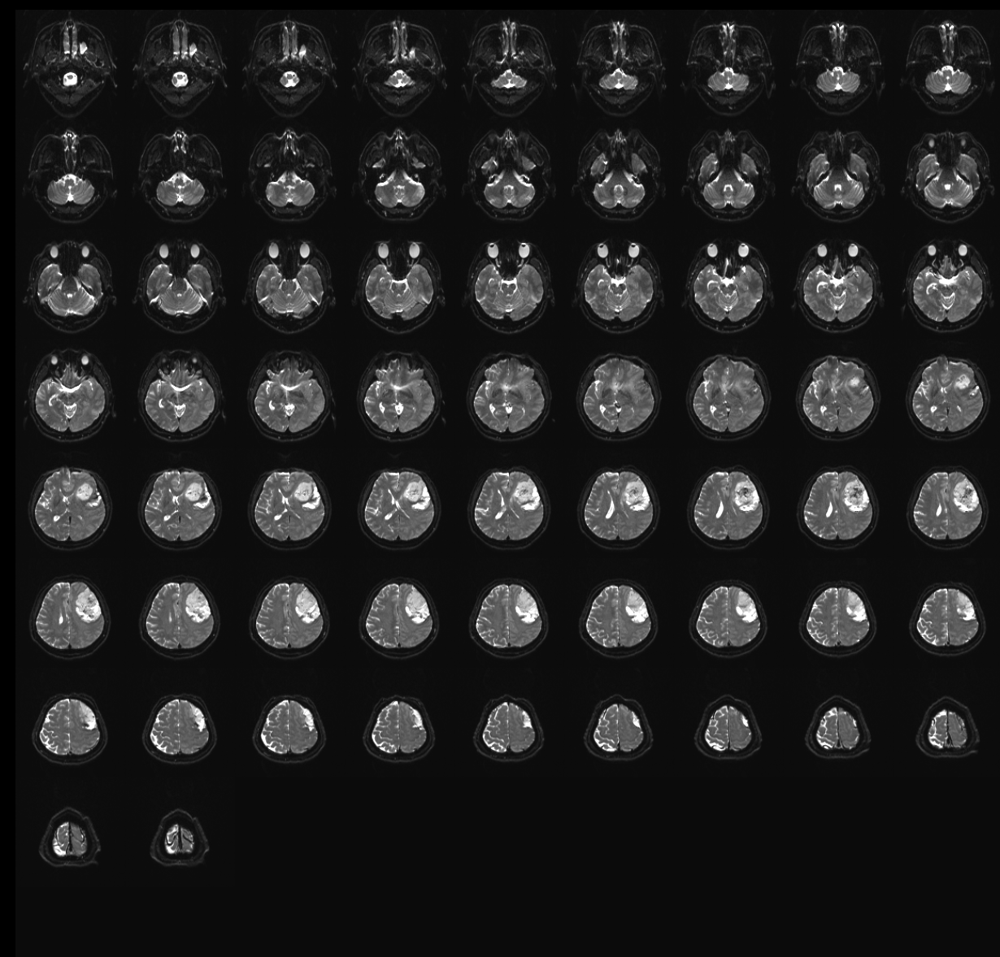

# Purpose
The purpose of this module is for the learner to
* Understand how a DICOM file is constructed (the anatomy of a DICOM file), including some key DICOM tags (SOPClassUID, SeriesInstanceUID, Patient module)
* Understand private tags
* Understand the difference between type 1, type 2 and type 3 DICOM tags
* Understand that, depending on the type of DICOM file, the tags present in the DICOM header may be different, and know about the single frame, and multi-frame (enhanced) formats, as well as the Siemens-proprietary mosaic format.

# Topics
## Anatomy of a DICOM file
At a high level, a DICOM file consists of a list of **DICOM Tags.** 

In a DICOM file, all information is given in a tag!



The image above shows the general anatomy of a DICOM file. It consists of several DICOM tags that contain meta-data about the contents (such as patient name, birth date, what type of study was conducted). 

Often, especially for us, the DICOM file will also contain a Pixel data field. This is the actual image-data of the file. Since this often contains a lot of data (in terms of megabytes), it is found at the end of the file, but the pixel data is encoded in the file just like any other tag.

A DICOM tag consists of two elements, and looks something like this: `(abcd, efgh)` where each letter is a hexidecimal value. For example,
* `(0010,0010)`, which contains the Patient Name
* `(7FE0,0010)`, which contains the Pixel data

The DICOM tags are sorted in ascending order in a DICOM file. Therefore, the Pixel data tag `(7FE0,0010)` will come very late, and often at the end, of a DICOM file. The reason for this is that software systems often only needs the meta data, such as patient name. By placing the values that are expensive to read, in terms of computing power, towards the end of the file, it saves systems time when searching though thousands or millions of DICOM files.

### Different "formats" or purposes of a DICOM file (information object definitions)
The DICOM standard defines a number of IOD's, or **Information Object Definitions**. These IODs can be thought of as the "format" of the DICOM file.

Examples of DICOM IODs are
* MR Image Storage
* Enhanced MR Image Storage
* Secondary Capture Image Storage
* CT Image Storage
* Radiotherapy Image

A full list of IOD's can be found in the DICOM standard at [this](https://dicom.nema.org/dicom/2013/output/chtml/part04/sect_i.4.html) link.

> **Key points of knowledge:**
> * The tags that are required to be present in a DICOM file, depends on the IOD that's used
> * The IOD that's used is defined in the DICOM header using the SOPClassUID (0008,0016) tag.
>   * The SOPClassUID for MR Image Storage is **1.2.840.10008.5.1.4.1.1.4**
>   * The SOPClassUID for Enhanced MR Image Storage is 1**.2.840.10008.5.1.4.1.1.4.1**

### Modules in a DICOM file
Once you have determined the IOD that's used for the DICOM file, we can find out what modules to include.

Examples of modules are
* Patient Module ([link](https://dicom.nema.org/dicom/2013/output/chtml/part03/sect_C.7.html#sect_C.7.1.1))
  * Includes tags related to the patient, such as the patient name, birth date etc.
* General Study Module ([link](https://dicom.nema.org/dicom/2013/output/chtml/part03/sect_C.7.html#sect_C.7.2.1))
  * Includes tags related to the study, such as study description, study date, study instance UID etc.
* General Series Module ([link](https://dicom.nema.org/dicom/2013/output/chtml/part03/sect_C.7.html#sect_C.7.3.1))
  * Includes tags related to the series, such as the series description, series instance UID etc.

**The selection of modules that are included in the header depends on the IOD that's used.**

See for example for the MRImageStorage IOD below.



You'll notice that the MR Image Storage IOD contains a list of modules. However, you'll also notice that the modules are labeled with a **usage label**. This will be described next.

#### Usage of modules can be mandatory or optional
When you have selected an IOD, the IOD will determine which modules you need to include, as described above.

The DICOM standard does, however, mandate that some modules are mandatory to include, whereas others are "user optional.

When looking up in the DICOM standard, these will be marked as "M" for mandatory, or "U" for user optional. User optional means that it is up to the author/creator of the DICOM file to include the module.

For example, the Clinical Trial Subject module is User Optional in the MR Image Storage IOD. This is because this module does not make sense to include in a clinical setting, but does make sense to include in a clinical trial setting. Therefore, it can be included is the DICOM file is intended for use in a clinical trial.

A third category is the conditional "C" category. This is required if certain conditions are met. The condition will be clearly labeled in the IOD definition, as in the image above.

#### When including a module, certain tags are required, but others not
A Module in the DICOM definition contains a list of DICOM tags. For example, the General Series Module contains the following tags (among others)



You'll notice that the tag comes with a attribute/tag name, a "tag value" on the form "(abcd,efgh)", a **type**, and a description.

It is important to understand the significance of the TYPE of the DICOM tag.

A DICOM tag can have the type 1, 2, 2C or 3. A Type 1 DICOM tag is required, if the module in which it resides is included.

Take, for example if the [General Series Module](https://dicom.nema.org/dicom/2013/output/chtml/part03/sect_C.7.html#sect_C.7.3.1).
If this module is included in the DICOM file,
* **Type 1** tags, such as `(0008,0060) Modality` and `(0020,000E) Series Instance UID` are required to be present in the DICOM file. Moreover, they are also required to have a **value**.
* **Type 1C** tags. These tags are required to be present, and have a value, if a certain condition is met.
* **Type 2** tags, such as the `(0020,0011) Series Number` tag, are required to be present in the DICOM file, but the DICOM standard allows for the value to be empty.
* **Type 2C** tags, such as the `(0020,0060) Laterality` tag is required to be present, if a certain condition is met. If the condition is met, the tag must be present, but, since it's a type 2, it may have an empty value.
* **Type 3** tags are fully optional, and it is up the author of the software that produces the DICOM file to include these tags or not. When reading a DICOM file, one can never rely on Type 3 tags to be present.

## Some important tags to know
* **Series Instance UID.** This tag uniquely identifies a DICOM series. A Series Instance UID shall be universally unique. No other DICOM series in the whole worlds shall share the Series Instance UID with another Series.
* **Series Description.** This typically tag describes the procedure that was performed to acquire the series. It may have a value that indicates that the MR acquisition was a perfusion or a diffusion, or the type of fMRI (motor, language etc)
* **SOP Class UID.** This value defines the whole DICOM file, and which modules it needs to include. For example, if the SOP Class UID tag has the value `1.2.840.10008.5.1.4.1.1.4`, we know that the DICOM file describes the MR Image Storage IOD. If the SOP Class UID has the value `1.2.840.10008.5.1.4.1.1.4.1`, i describes the Enhanced MR Image Storage IOD. See all SOP Class UIDs [here](https://dicom.nema.org/dicom/2013/output/chtml/part04/sect_i.4.html).

## Private tags
Below is the first few tags in the DICOM header of a generic DICOM file.
```
(0002,0000) UL FileMetaInformationGroupLength = 194
(0002,0001) OB FileMetaInformationVersion = <bin: 0x0001>
(0002,0002) UI MediaStorageSOPClassUID = 1.2.840.10008.5.1.4.1.1.4
(0002,0003) UI MediaStorageSOPInstanceUID = 1.2.276.0.7230010.3.1.4.0.85484.1727966367.409023
(0002,0010) UI TransferSyntaxUID = 1.2.840.10008.1.2.1
(0002,0012) UI ImplementationClassUID = 1.2.276.0.7230010.3.0.3.6.7
(0002,0013) SH ImplementationVersionName = OFFIS_DCMTK_367 
(0008,0005) CS SpecificCharacterSet = ISO_IR 100
(0008,0008) CS ImageType = ORIGINAL\PRIMARY\M_FFE\M\FFE
(0008,0012) DA InstanceCreationDate = 20111103
(0008,0013) TM InstanceCreationTime = 125024
(0008,0014) UI InstanceCreatorUID = 1.3.46.670589.11.38229.5
(0008,0016) UI SOPClassUID = 1.2.840.10008.5.1.4.1.1.4
(0008,0018) UI SOPInstanceUID = 1.2.276.0.7230010.3.1.4.0.85484.1727966367.409023
(0008,0020) DA StudyDate = 20111103
(0008,0021) DA SeriesDate = 20111103
```

You'll notice that the first element in all these tags are **even-numbered**. This is no coincidence. 

All "public" DICOM tags, or tags that are formally described in the DICOM standard, start with an even number.

The DICOM standard also allows for PRIVATE tags. Private tags can be used by vendors, manufacturers or creators of DICOM fils to store proprietary, non-standard data.

For example NNL uses the `(0055,XXXX)` group for all private tags. We store, for example, the processing settings used to generate a map.

The MR manufacturers, GE, Siemens and Philips will also use private tags to store certain information. For example, GE will use private tags to store information about the diffusion sequence required for diffusion and tractography analysis through the nordicTRACT module in nordicMEDiVA. GE does this even though standard tags exist, likely due to legacy reasons.

In some cases, Philips will also store the diffusion information in a proprietary way.

**Private tags introduces a lot of complexity to our interpretation of DICOM files.**

## Important DICOM "formats" we will encounter in with nordicMEDiVA
With nordicMEDiVA, we will normally not be exposed to all the possible formats or variations that can occur withing the DICOM standard.

Here, we'll explore and explain the most important formats or variations to know about.

### "Normal" MR Image Storage DICOM
These files are identified by having the `SOPClassUID` DICOM tag equal to `1.2.840.10008.5.1.4.1.1.4`. If the ImageType DICOM tag has the value "Mosaic", see explanation below.

This format is the "normal" or "traditional" format for storing MR images. What characterizes this format is that each DICOM file describes a single slice in the MR image. We need several files to reconstruct a 3D volume, and even more to reconstruct a 4D series.

The PixelData DICOM tag contains the pixel data, and the dimensions of the pixel data array is described by the `(0028,0010) Rows` and `(0028,0011) Columns` DICOM tags. The pixel data value describes a single 2D image.

Advanced users may be interested in knowing that
* the numerical value of each element in the pixel data DICOM tag must have an integer value. The value can be scaled using the `(0028,1052) Rescale Intercept` and `(0028,1053)Rescale Slope` attributes before presenting to the user.
  * Interestingly, these tags are not part of the MRImageStorage IOD. This shows that it is possible to "borrow" tags from other IODs if it's natural to do so. But you cannot rely on other systems using the tags. 

### MR Image Storage with MOSAIC
For fMRI, we typically acquire very many volumes in a single exam/series. Using the traditional way to store the date, using the MR Image Storage IOD, this will lead to an insane amount of files generated. It was early discovered that this was an issue, but the DICOM standard did now formally provide a solution.

Siemens, therefore, developed a proprietary DICOM format, based on the MR Image Storage format, that would include all slices in a given volume in a single DICOM file.

This format was named "mosaic" because, when looking at the pixel data of a DICOM file with this format, it is a grid (or "mosaic") of all slices in the given volume. See image below.

When a DICOM series is decoded using the MOSAIC format, the following is true:
* The value of the Rows and Columns DICOM tags don't describe the number of rows and columns in each slice, but the number of rows and columns in the stacked mosaic
* To reconstruct the mosaic, Siemens private tags must be read. These tags, and content of which, have changed several times over the years, making it difficult to handle

Siemens has abandoned the mosaic format on newer scanners in favour of the Enhanced MR Image Storage format, which is similar. United Imaging are still using a similar form of mosaic, but using their own private tags



### Enhanced MR Image Storage
The Enhanced MR Image Storage format is the modern, standardized DICOM solution to the problems that the mosaic format was originally created to solve.

Files using this format are identified by having the SOPClassUID equal to `1.2.840.10008.5.1.4.1.1.4.1`.

This format is part of the Enhanced Multi-frame Image IODs, introduced to allow multiple images (slices, time points, diffusion directions, etc.) to be stored within a single DICOM object, without relying on vendor-specific private tags.

At NNL, we will see Enhanced MR DICOM used for fMRI, where all slices within a volume has been stored in the same file, or, for the case of diffusion, all slices of a single diffusion direction is stored in the same file.

Using Enhanced DICOM reduces the load on the network, and increases the transfer speed of DICOM images drastically.

## Other important tags to know about
* [(0028,0004) Photometric interpretation](https://dicom.innolitics.com/ciods/computed-radiography-image/image-pixel/00280004) - For RGB images

