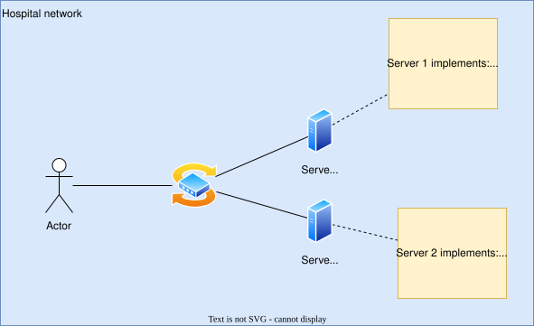

# Activity 3-1 - DICOM Networking

## Exercise 1
Can you correctly label which of the parties are acting as `C-ECHO SCU` and `C-ECHO SCP`?

## Exercise 2
Consider the diagram below. Which of the following DICOM associations will be successful?
1. Actor tries to echo Server 1
2. Actor tries to echo Server 2
3. Server 1 tries to echo Server 2
4. Server 2 tries to echo Server 1
5. Actor tries to send DICOM images to Server 1
6. Actor tries to send DICOM images to Server 2
7. Server 1 tries to send DICOM images to Server 2
8. Server 2 tries to send DICOM images to Server 1

