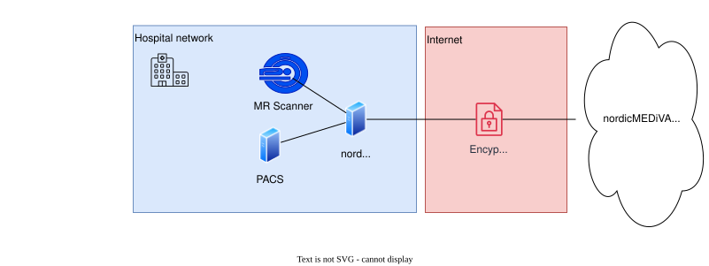

# Module 7: DICOM Web

## Purpose

The purpose of this module is for the learner to understand
* what the DICOM Web protocol is
* what is the difference between DICOM Web and DICOM DIMSE
* When nordicMEDiVA uses DICOM Web and when it uses normal DICOM DIMSE
* How the network diagram looks like when nordicMEDiVA uses DICOM web when transmitting data between the on-site network and a SaaS environment of nordicMEDiVA
* Why does nordicMEDiVA use DICOM web in some cases, and in other cases not?
  * Think of the different configurations we have:
    * On prem (self-hosted)
    * Cloud (VPN)
    * Cloud (EC2)
    * Cloud (ECS)
* How does the nordicDicomGateway software work?

## Topics

### What Is DICOM Web?

DICOM Web (often written as DICOMweb) is a modern, web-based way of transferring DICOM data. It is part of the DICOM standard and defines how DICOM objects can be accessed and exchanged using HTTP and REST APIs, instead of the traditional DICOM network protocol (DIMSE).

### DICOM Web vs "Normal" DICOM DIMSE

| Element      | DICOM Web                                                                                                           | DICOM DIMSE                                                                                                                      |
| ------------ | ------------------------------------------------------------------------------------------------------------------- | -------------------------------------------------------------------------------------------------------------------------------- |
| Port         | Uses a standard web port, such as 80 or 443                                                                         | Uses any port, but typically 104 or 11112                                                                                        |
| Address      | Uses a URL to connect to another AE                                                                                 | Uses AE title, IP and port to connect to another AE                                                                              |
| Encryption   | Readily available using SSL/HTTPS                                                                                   | Available, but historically not widely supported or deployed across MR scanners, PACS systems, and other DICOM devices           |
| Suitable for | Connections over the web due to readily available solutions for web traffic (such as load balancers and encryption) | Connections inside a secure hospital network, such as between MR scanners, PACS, our nordicDICOMGateway, or other DICOM systems. |

### Core DICOM Web services
While the "normal" DICOM DIMSE protocol has the C-STORE, C-ECHO, C-FIND and C-MOVE "commands", the DICOM Web protocol defines several REST-based services. The most important ones are:
* **QIDO-RS** – Query DICOM objects (roughly equivalent to C-FIND)
* **WADO-RS** – Retrieve DICOM objects (roughly equivalent to C-GET / C-MOVE)
* **STOW-RS** – Store DICOM objects (roughly equivalent to C-STORE)

For our purposes, we don't need to know more than nordicMEDiVA uses only the STOW-RS "command". But the other "commands" may be referenced in conversation, so they are still useful to know about.

### When does nordicMEDiVA use DICOM Web
#### History / background
When we first started to deploy nordicMEDiVA in the cloud, we ensured that the DICOM data was encrypted in transit between the customer site to AWS by using a site-to-site VPN.

It was soon discovered that this configuration was hard to maintain and set up, and it also made it harder to have a clear isolation of the on-prem/cloud networks specifically, and on-prem/cloud environments generally.

The site-to-site configuration also received push-back from some prospective customers since they did not want to allow other systems onto their network, and often did not have the systems and processes in place to properly isolate such VPN connections in order to mitigate this risk vector.

After testing the site-to-site configuration with a few sites when we first started deploying nordicMEDiVA, we found that it was hard to set up from our side, and was not generally desired by the customers. We also discovered that a more common architecture used by other companies who need to transfer DICOM imaging data between an on-site network and a cloud environment, was to use some sort of on-site software that could securely transfer the data to the cloud. Such a device is often called a DICOM edge device or a DICOM gateway.

The most important requirement for such a DICOM gateway/edge device is to **transfer DICOM data between the cloud and on-prem in an encrypted network connection**.

### Use of DICOM Web in nordicMEDiVA
In order to transfer data securely between the on-site network and the cloud, we use the DICOM Web protocol.

Using DICOM Web, we can leverage widely used standards for encryption of web traffic. We use TLS 1.2 or 1.3 (HTTPS).

We do this using the nordicDICOMGateway component.

* **The nordicDICOMGateway ensures that DICOM transfer between the on-prem network and the cloud/SaaS is encrypted.**
* When nordicMEDiVA is deployed on-prem, or using the legacy VPN configuration of the SaaS, the nordicDICOMGateway CANNOT be used, since secure cloud-bound HTTPS communication is not required or applicable in these configurations. In this case, the security of the DICOM Transfer is handled by:
  * Trusting the local network, on which the SaaS mediva instance is connected directly
  * Encryption between the cloud and on-prem using the VPN

The diagram below shows a very basic network diagram of how the gateway fits in to a possible hospital network.

### How does the nordicDicomGateway work?
The nordicDICOMGateway works in two directions, depending on which way the DICOM data is going.

Either

1. The DICOM data is sent from an on-prem system (such as MR scanner or PACS) to nordicMEDiVA Saas
2. OR, the DICOM data is sent from nordicMEDiVA SaaS to an on-prem system (such as PACS or, typically, a neuronavigation system - for example BrainLab or Medtronic)

Below is an explanation of how each of these scenarios work, from a networking perspective.

#### Data Flow: From Hospital to Cloud

When DICOM data is sent **from the hospital network to the nordicMEDiVA cloud**, the nordicDicomGateway acts as an intermediary between classical DICOM DIMSE and DICOM Web.

The typical execution flow is as follows:

1. **DICOM data is sent to the gateway using DIMSE**
   - A user or system (e.g. MR scanner or PACS) initiates a **DICOM C-STORE** operation to the nordicDicomGateway.
   - The gateway acts as a **DICOM Store SCP**.
   - Connection parameters:
     - **IP address:** Configured per installation (no default)
     - **Port:** `4242`
     - **AE Title:** `MEDIVA`

2. **Data is received and stored locally**
   - The gateway receives one or more DICOM objects.
   - Once the DICOM association is closed, the data is temporarily stored on the gateway’s local disk.

3. **Secure transfer to the cloud using DICOM Web**
   - The gateway initiates an **outbound HTTPS (DICOM Web) connection** to the nordicMEDiVA SaaS endpoint.
   - Authentication is performed using:
     - The nordicMEDiVA SaaS URL
     - A shared secret issued via nordicMEDiVA’s authentication system (e.g. Keycloak).
   - The DICOM data is transmitted to nordicMEDiVA SaaS using the **STOW-RS** service.

4. **Cleanup after successful transfer**
   - Once all DICOM data has been successfully received by the SaaS:
     - The corresponding files are deleted from the gateway’s local disk.

5. **Retry behavior on failure**
   - If the transfer attempt is unsuccessful:
     - The gateway retries the upload periodically.
     - Temporary network outages or SaaS unavailability are handled automatically.
   - If all retry attempts fail over a period of **48 hours**:
     - The locally stored DICOM data is deleted to prevent unbounded disk usage.

#### Data Flow: From Cloud to Hospital

When a user or automation rule marks DICOM data to be transferred **from the nordicMEDiVA SaaS back to a DICOM-compatible system in the hospital**, the following execution flow is used.

1. **DICOM data is marked for export**
   - A user action or an automation rule in nordicMEDiVA SaaS marks one or more DICOM objects for transfer.
   - The data is associated with a **destination AE Title**, representing a DICOM node in the hospital environment.
   - nordicMEDiVA SaaS maintains a list of DICOM data that is pending transfer.

2. **The nordicDicomGateway polls the SaaS**
   - The nordicDicomGateway periodically sends a **REST request over HTTPS** to the nordicMEDiVA SaaS, asking whether there is DICOM data ready to be transferred.
   - This communication uses standard web protocols and is initiated by the gateway (outbound connection).

3. **DICOM data is pulled from the SaaS**
   - If data is available, the gateway **pulls the relevant DICOM series** from nordicMEDiVA SaaS using DICOM Web.
   - The pulled data is temporarily stored on the gateway’s local disk.

4. **Forwarding to the hospital DICOM node**
   - The gateway forwards the DICOM data to the destination system using **DICOM DIMSE (C-STORE)**.
   - The destination DICOM node is selected based on the AE Title associated with the data.
   - All destination nodes must be defined in the gateway’s `modalities.json` configuration file.

5. **Cleanup after successful transfer**
   - Once the DICOM data has been successfully forwarded to the destination DICOM node:
     - The corresponding files are deleted from the gateway’s local disk.

6. **Retry behavior on failure**
   - If the gateway is unsuccessful in sending data to the destination system:
     - It retries the transfer periodically.
   - If no successful transfer is achieved within **48 hours**:
     - The locally stored DICOM data is deleted to prevent unbounded disk usage.

## Most important things to know

* The nordicDICOMGateway component ensures encrypted traffic between the on-prem network and the nordicMEDiVA cloud
* The encryption is over TLS 1.2 or 1.3, using the HTTPS protocol
* ALL network connections between the gateway and the nordicMEDiVA SaaS are initiated from the gateway (i.e., inside the hospital).
  * This will often reduce or remove the need for special firewall rules
* The DICOM going through the nordicDICOMGateway is transient. Once the DICOM data has been successfully sent to its destination, it will be deleted from the gateway disk. 
  * If there is a failure in sending, the gateway will retry for 48 hours.
  * If no success after 48 hours, the gateway will delete the data from the disk

